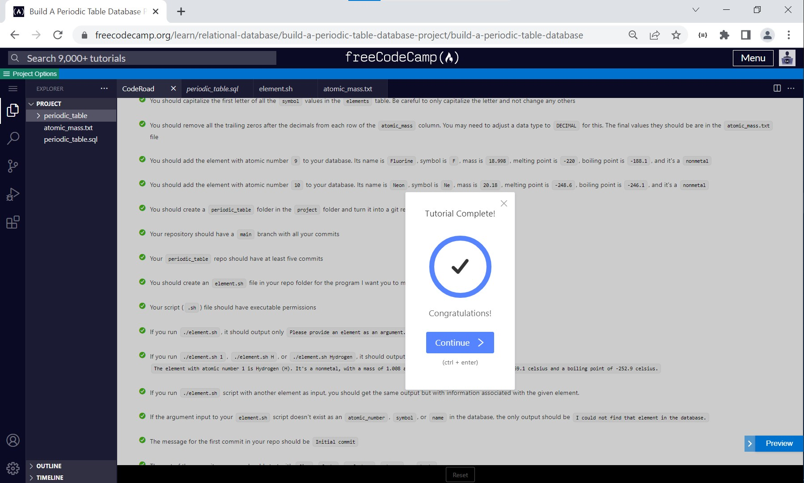
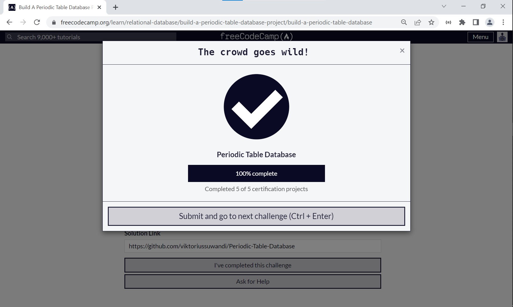

# Periodic Table Database
#### Open [`file solution.txt`](solution.txt) To follow my terminal command. Solutions divided into several steps :
    1. Create Database and connect to it.
    2. Create tables as required conditions.
    3. Fill table services with initial data.
    4. Primary Key and Foreign Key assignment.
    5. Compact queries into salon.sql file.
    6. Create shell scipt files and give executable permission to the file.
    7. Run shell script salon.sh file.

#### Solution can be found on : 
[https://replit.com/@ViktoriusSuwand/Periodic-Table-Database](https://replit.com/@ViktoriusSuwand/Periodic-Table-Database)

#### Documentation can be found on :[https://github.com/viktoriussuwandi/Periodic-Table-Database](https://github.com/viktoriussuwandi/Periodic-Table-Database)

This is the result to complete the Periodic Table Database project. 
Instructions for building this project can be found at 
[https://www.freecodecamp.org/learn/relational-database/build-a-periodic-table-database-project/build-a-periodic-table-database](https://www.freecodecamp.org/learn/relational-database/build-a-periodic-table-database-project/build-a-periodic-table-database)

## Instructions

## CodeRoad

## Result
### Testing

### Submission
